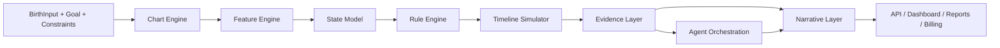

# Saju Simulation Platform

사주를 입력으로 사용해 중요한 선택을 월/주 단위 세계선으로 시뮬레이션하는 결정 지원형 플랫폼이다.

## North Star

이 프로젝트는 운세 텍스트 생성기가 아니다.  
이 프로젝트는 `사주 계산 엔진 -> 상태모델 -> 시뮬레이터 -> LLM 설명 레이어` 4층 코어를 기반으로, 사용자의 인생 분기점을 설명 가능한 방식으로 예측하는 시뮬레이션 플랫폼이다.

## Core Principles

1. 계산은 결정론적으로 수행한다.
2. 상태 변화와 사건 생성은 룰 엔진이 담당한다.
3. LLM은 사실을 만들지 않고 설명만 담당한다.
4. 모든 결과는 `seed`, `lineage`, `evidence_refs`로 재현 가능해야 한다.
5. 멀티에이전트는 계산 레이어가 아니라 해석 오케스트레이션 레이어다.

## System Overview

## Target Stack

- Backend: Python, FastAPI
- Storage: PostgreSQL + JSONB
- Queue/Realtime: Redis Streams, Celery
- API contract: REST first
- LLM integration: explanation and action-script generation only

## Documents

- [제품 개요](docs/01-product-overview.md)
- [코어 아키텍처](docs/02-core-architecture.md)
- [도메인 모델](docs/03-domain-model.md)
- [차트 엔진 명세](docs/04-chart-engine-spec.md)
- [상태모델 명세](docs/05-state-model-spec.md)
- [시뮬레이션 명세](docs/06-simulation-spec.md)
- [룰 엔진 명세](docs/07-rule-engine-spec.md)
- [에이전트 오케스트레이션](docs/08-agent-orchestration.md)
- [LLM 설명 레이어 명세](docs/09-narrative-layer-spec.md)
- [API 계약](docs/10-api-contract.md)
- [저장소와 lineage](docs/11-storage-and-lineage.md)
- [테스트 플랜](docs/12-test-plan.md)
- [구현 로드맵](docs/13-implementation-roadmap.md)

## Implementation Gate

구현은 다음 문서가 잠긴 후 시작한다.

1. `docs/02-core-architecture.md`
2. `docs/03-domain-model.md`
3. `docs/04-chart-engine-spec.md`
4. `docs/10-api-contract.md`
