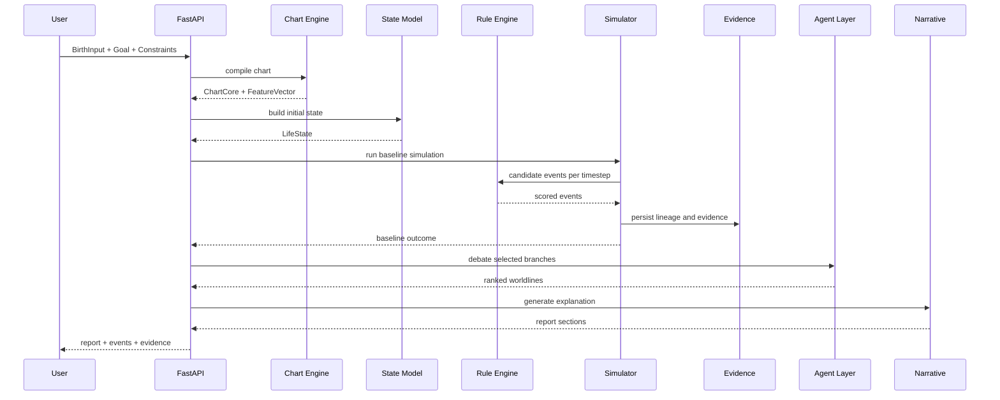

# 02. Core Architecture

## Architecture Summary

코어는 네 개의 계산 레이어와 세 개의 지원 레이어로 나뉜다.

1. Chart Engine
2. State Model
3. Simulator
4. Narrative Layer
5. Evidence Layer
6. Agent Orchestration
7. API / Async Infrastructure

## Layer Responsibilities

| Layer | Responsibility | LLM Allowed | Output |
| --- | --- | --- | --- |
| Chart Engine | 출생정보를 차트와 파생 피처로 변환 | No | `ChartCore`, `FeatureVector` |
| State Model | 초기 상태와 자원 스케일 정의 | No | `LifeState` |
| Simulator | timeline factor, event generation, branch runs | No | `SimulationRun`, `BranchOutcome`, `EventCandidate` |
| Evidence Layer | lineage, refs, replay metadata 저장 | No | `EvidenceRef`, state snapshots |
| Agent Orchestration | 세계선 해석, 반박, 집계 | Yes, grounded only | `DebateMessage`, ranked scenarios |
| Narrative Layer | 설명, 조언, 대화 스크립트 생성 | Yes, grounded only | `NarrativeSection` |
| API / Infra | 입출력, 저장, 큐, 비동기 처리 | No | REST responses, jobs |

## Data Flow

## Infrastructure Roles

### FastAPI

- public REST API
- input validation
- async job creation
- status query endpoints

### PostgreSQL + JSONB

- source of truth for runs, events, reports, policies
- JSONB for flexible evidence and state snapshots

### Redis Streams

- append-only event stream for simulation progress and report generation

### Celery

- long-running chart validation
- baseline and branch simulations
- debate execution
- report generation

## Hard Boundaries

### Chart Engine boundary

- takes `BirthInput`
- returns deterministic outputs
- must not depend on user mood, goals, or LLM

### State Model boundary

- consumes `FeatureVector` and user goal/constraints
- produces state only
- does not create narrative

### Simulator boundary

- updates state and emits events
- may use randomness only through explicit `seed`
- never calls LLM

### Narrative boundary

- reads facts and evidence only
- cannot alter event score, event type, lineage, or timeline

## Non-goals

- end-user UI details
- payment implementation
- social sharing implementation
- B2B analytics
