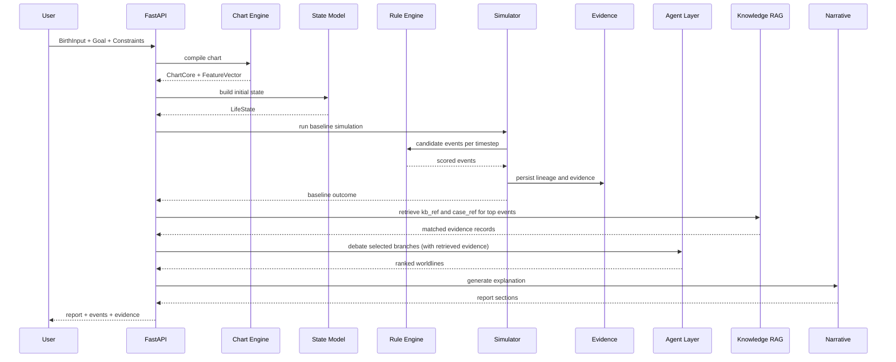

# 02. Core Architecture

## Architecture Summary

코어는 네 개의 계산 레이어와 세 개의 지원 레이어로 나뉜다.

1. Chart Engine
2. State Model
3. Simulator
4. Narrative Layer
5. Evidence Layer
6. Knowledge Retrieval (RAG)
7. Agent Orchestration
8. API / Async Infrastructure

## Layer Responsibilities

| Layer | Responsibility | LLM Allowed | Output |
| --- | --- | --- | --- |
| Chart Engine | 출생정보를 차트와 파생 피처로 변환 | No | `ChartCore`, `FeatureVector` |
| State Model | 초기 상태와 자원 스케일 정의 | No | `LifeState` |
| Simulator | timeline factor, event generation, branch runs | No | `SimulationRun`, `BranchOutcome`, `EventCandidate` |
| Evidence Layer | lineage, refs, replay metadata 저장 | No | `EvidenceRef`, state snapshots |
| Knowledge Retrieval | 고전/현대 문헌 검색, 유사 사례 매칭 | No (embedding only) | `kb_ref`, `case_ref` evidence records |
| Agent Orchestration | 세계선 해석, 반박, 집계 | Yes, grounded only | `DebateMessage`, ranked scenarios |
| Narrative Layer | 설명, 조언, 대화 스크립트 생성 | Yes, grounded only | `NarrativeSection` |
| API / Infra | 입출력, 저장, 큐, 비동기 처리 | No | REST responses, jobs |

## Data Flow

## Infrastructure Roles

### FastAPI

- public REST API
- input validation
- async job creation
- status query endpoints

### PostgreSQL + JSONB

- source of truth for runs, events, reports, policies
- JSONB for flexible evidence and state snapshots

### Redis Streams

- append-only event stream for simulation progress and report generation

### Celery

- long-running chart validation
- baseline and branch simulations
- debate execution
- report generation

## Hard Boundaries

### Chart Engine boundary

- takes `BirthInput`
- returns deterministic outputs
- must not depend on user mood, goals, or LLM

### State Model boundary

- consumes `FeatureVector` and user goal/constraints
- produces state only
- does not create narrative

### Simulator boundary

- updates state and emits events
- may use randomness only through explicit `seed`
- never calls LLM

### Narrative boundary

- reads facts and evidence only
- cannot alter event score, event type, lineage, or timeline

### Knowledge Retrieval boundary

- retrieves `kb_ref` (고전/현대 문헌) and `case_ref` (유사 사례) via embedding similarity
- uses Gemini Embedding 2 for vector indexing
- does not generate new facts — only retrieves existing knowledge
- does not replace Rule Engine judgment — supplements evidence only
- retrieved records feed into Agent debate as additional evidence_refs

### Knowledge Base Contents

| Category | 예시 |
| --- | --- |
| 고전 원전 청크 | 적천수, 자평진전, 궁통보감 등 단락별 분할 |
| 현대 해석 자료 | 한국 실전 명리학 서적, 학술 논문 |
| 룰 설명 문서 | Rule Engine 규칙별 해설 |
| 백테스트 패턴 | 과거 시뮬레이션의 검증된 이벤트 패턴 |

### RAG Constraints

- 임베딩은 "의미상 유사도" 검색 도구이며, 규칙 판정기를 대체하지 않는다
- 최종 판정은 반드시 Rule Engine + State Model + Scorer가 수행
- RAG 결과는 confidence_weight를 포함하여 evidence 품질을 구분

## Non-goals

- end-user UI details
- payment implementation
- social sharing implementation
- B2B analytics
