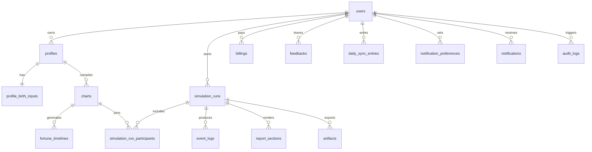

# 사주 라이프 시뮬레이터 Schema Reference

Last updated: `2026-03-17 (KST)`  
Scope: `researchpromt.md`, `result1.md`, `result2.md`, `result4.md`를 바탕으로 정리한 서비스 전용 데이터/계약 명세  
Principle: `결정론 계산 데이터`, `사용자 민감정보`, `이벤트 로그`, `유료 서술 데이터`를 분리해 저장한다.

## 0. 설계 원칙
- `schema_version`, `engine_version`, `policy_version`은 모든 핵심 결과물에 필수다.
- 출생 원본 입력과 파생 차트 결과는 분리 저장한다.
- 이벤트 로그는 append-only를 기본으로 하고, 요약/클러스터링 결과는 별도 필드로 관리한다.
- 리포트와 이벤트의 무료/유료 콘텐츠는 같은 객체 안에 두되 필드를 분리한다.
- 백테스트, 감정 동기화, 결제 데이터는 차트/런과 연결 가능해야 한다.
- MiroFish의 그래프 구조를 그대로 재현하지 않고, `PostgreSQL + JSONB + Redis Streams + Object Storage`를 기본 저장 전략으로 한다.

## 1. 엔터티 관계 개요



## 2. 공통 Enum

### 2.1 도메인
| 값 | 의미 |
|---|---|
| `wealth` | 재물, 자산, 계약, 투자 |
| `career` | 이직, 승진, 평판, 업무 성과 |
| `relationship` | 연애, 결혼, 동업, 대인 갈등 |
| `health` | 체력, 스트레스, 수면, 컨디션 |

### 2.2 타임 스코프
| 값 | 의미 |
|---|---|
| `monthly` | 연간 기본 노출 단위 |
| `weekly` | 특정 월 확대 단위 |
| `daily` | 미래 확장용 초디테일 단위 |

### 2.3 런 타입
| 값 | 의미 |
|---|---|
| `solo` | 1인 시뮬레이션 |
| `synastry` | 2인 관계/궁합 시뮬레이션 |
| `team` | 추후 팀/동업 확장 |

### 2.4 런 상태
| 값 | 의미 |
|---|---|
| `queued` | 작업 대기 |
| `running` | 실행 중 |
| `completed` | 완료 |
| `failed` | 실패 |
| `canceled` | 취소 |

### 2.5 이벤트 가시성
| 값 | 의미 |
|---|---|
| `public_teaser` | 무료 티저 |
| `paid_detail` | 결제 후 상세 |
| `internal_only` | 운영/품질용 |

### 2.6 결제 타입
| 값 | 의미 |
|---|---|
| `subscription` | 정기 구독 |
| `one_off` | 단건 구매 |

### 2.7 피드백 타입
| 값 | 의미 |
|---|---|
| `backtest_label` | 과거 사건 라벨 |
| `rating` | 만족도 평가 |
| `bug` | 오류 신고 |

## 3. API JSON 계약

### 3.1 Chart Compile Request

```json
{
  "profile_label": "나",
  "birth": {
    "calendar": "solar",
    "year": 1990,
    "month": 10,
    "day": 10,
    "hour": 14,
    "minute": 30,
    "timezone": "Asia/Seoul",
    "gender": "male",
    "birth_place": {
      "city": "Seoul",
      "lat": 37.5665,
      "lon": 126.9780
    },
    "leap_month": false
  },
  "policy": {
    "use_solar_time": false,
    "early_zi_time": true,
    "jieqi_month_rule": "kasi_based",
    "policy_version": "policy.v1"
  },
  "goal": {
    "category": "career",
    "question": "이직 타이밍과 리스크를 알고 싶다",
    "horizon_months": 12,
    "risk_tolerance": "medium"
  },
  "supplemental_context": {
    "occupation": "developer",
    "relationship_status": "single",
    "residence_type": "jeonse",
    "asset_band": "mid",
    "mbti": "INTJ"
  },
  "constraints": {
    "must_avoid": ["debt", "conflict"],
    "current_status": {
      "job": "developer",
      "relationship": "single"
    }
  }
}
```

필수 규칙:
- `birth`는 원본 재현을 위해 삭제/마스킹 전까지 그대로 보존 가능해야 한다.
- `policy`는 엔진 계산에 영향을 주므로 별도 버전 관리 대상이다.
- `goal`과 `constraints`는 결정론 계산이 아니라 `이벤트 중요도`와 `서술 우선순위`에 주로 영향을 준다.

### 3.2 Chart Compile Response

```json
{
  "chart_id": "chart_01HXYZ",
  "schema_version": "saju.v1",
  "engine_version": "engine.2026.03",
  "policy_version": "policy.v1",
  "chart_core": {
    "pillars": {
      "year": { "stem": "경", "branch": "오" },
      "month": { "stem": "정", "branch": "유" },
      "day": { "stem": "갑", "branch": "자" },
      "hour": { "stem": "무", "branch": "신" }
    },
    "hidden_stems": {
      "오": ["정", "기"],
      "유": ["신"],
      "자": ["계"],
      "신": ["경", "임", "무"]
    },
    "strength": {
      "score": 62,
      "label": "중강"
    }
  },
  "features": {
    "element": {
      "vec5": {
        "wood": 0.24,
        "fire": 0.10,
        "earth": 0.18,
        "metal": 0.28,
        "water": 0.20
      },
      "excess_deficit": {
        "wood": 0.04,
        "fire": -0.10,
        "earth": -0.02,
        "metal": 0.08,
        "water": 0.00
      }
    },
    "tengod": {
      "vec10": {
        "bijian": 0.15,
        "geopjae": 0.05,
        "siksin": 0.08,
        "sanggwan": 0.07,
        "jeongjae": 0.10,
        "pyeonjae": 0.12,
        "jeonggwan": 0.14,
        "pyeongwan": 0.09,
        "jeongin": 0.12,
        "pyeonin": 0.08
      }
    },
    "relations": {
      "hits": [
        {
          "scope": "natal",
          "type": "충",
          "a": "자",
          "b": "오",
          "strength": 0.7
        }
      ]
    },
    "yongshin": {
      "targets": [
        { "kind": "element", "value": "fire", "weight": 0.6 }
      ]
    }
  }
}
```

### 3.3 Fortune Timeline Entry

```json
{
  "timeline_type": "monthly",
  "bucket": "2026-01",
  "start_date": "2026-01-01",
  "end_date": "2026-01-31",
  "factors": {
    "element_delta": {
      "wood": 0.02,
      "fire": -0.05,
      "earth": 0.01,
      "metal": 0.00,
      "water": 0.02
    },
    "domain": {
      "wealth": -0.10,
      "career": 0.05,
      "relationship": -0.02,
      "health": 0.00
    },
    "relation_hits": [
      {
        "scope": "natal_vs_month",
        "type": "합",
        "a": "갑",
        "b": "기",
        "strength": 0.4
      }
    ]
  }
}
```

### 3.4 Simulation Run

```json
{
  "run_id": "run_01HABC",
  "run_type": "solo",
  "status": "running",
  "horizon": {
    "year": 2026,
    "base_scope": "monthly",
    "zoom_scope": "weekly"
  },
  "cost_estimate": {
    "token_budget": 12000,
    "zoom_budget_per_month": 2
  }
}
```

### 3.5 Event Log Object

```json
{
  "event_id": "evt_01H001",
  "run_id": "run_01HABC",
  "time_bucket": "2026-09",
  "scope": "monthly",
  "domain": "wealth",
  "event_type": "cashflow_drop_risk",
  "actors": {
    "self": "chart_01HXYZ",
    "other": null,
    "npc": ["unexpected_expense"]
  },
  "cause": {
    "relation_hits": [
      { "type": "충", "strength": 0.78 }
    ],
    "element_delta": {
      "water": -0.16
    },
    "rule_ids": ["RULE-WEALTH-004", "RULE-CONFLICT-002"]
  },
  "impact": {
    "wealth": -18,
    "career": -4,
    "relationship": -2,
    "health": -3
  },
  "confidence": 0.72,
  "importance": 0.88,
  "emotion_delta": -0.15,
  "tradeoffs": {
    "gain": ["단기 현금 방어"],
    "cost": ["관계 피로", "건강 저하"]
  },
  "narrative_teaser": "9월에는 예기치 않은 지출과 계약 스트레스가 겹칠 가능성이 높습니다.",
  "narrative_full": "상세 결제 후 제공",
  "avoidance_plan": [
    "고액 지출 결정은 48시간 유예",
    "계약 문구는 제3자 검토 후 확정"
  ],
  "action_scripts": [
    {
      "audience": "manager",
      "script": "이번 건은 일정과 비용을 다시 확인한 뒤 내일 답드리겠습니다."
    }
  ],
  "evidence_refs": [
    {
      "rule_id": "RULE-WEALTH-004",
      "feature_snapshot_hash": "sha256:abc",
      "log_ref": "artifact://raw_logs/evt_01H001.jsonl"
    }
  ],
  "merged_into_event_id": null
}
```

### 3.6 Report Section

```json
{
  "report_section_id": "sec_01HAA",
  "run_id": "run_01HABC",
  "section_key": "career",
  "title": "커리어 흐름",
  "content_free": "상반기에는 역할 재정의 압력이 크고, 하반기에 기회가 열립니다.",
  "content_paid": "4월 충돌은 권한 이슈에서 시작되며, 8월 이후 이동이 더 유리합니다.",
  "evidence_cards": [
    {
      "event_id": "evt_01H001",
      "headline": "9월 계약 리스크",
      "rule_ids": ["RULE-WEALTH-004"]
    }
  ],
  "paywall_gate": {
    "requires": "subscription_pro",
    "fallback_cta": "9월 상세 근거 보기"
  },
  "action_guides": [
    {
      "event_id": "evt_01H001",
      "guide_type": "avoidance",
      "title": "9월 계약 리스크 회피 루트"
    }
  ]
}
```

### 3.7 Backtest Feedback

```json
{
  "feedback_type": "backtest_label",
  "run_id": "run_01HABC",
  "year": 2023,
  "labels": [
    {
      "time_bucket": "2023-05",
      "domain": "career",
      "occurred": true,
      "intensity": 4,
      "confidence": "clear"
    }
  ]
}
```

### 3.8 Daily Sync Entry

```json
{
  "entry_date": "2026-03-17",
  "mood": 3,
  "stress": 4,
  "sleep_hours": 5.5,
  "spend_level": 4,
  "memo": "회의가 길어 피로했고 지출이 많았다."
}
```

## 4. 관계형 스키마

### 4.1 `users`
| column | type | nullable | note |
|---|---|---|---|
| `id` | uuid | NO | PK |
| `email` | text | NO | unique |
| `password_hash` | text | YES | 소셜 로그인 전용이면 null 허용 |
| `display_name` | text | YES | 사용자 표시명 |
| `locale` | text | NO | default `ko-KR` |
| `timezone` | text | NO | default `Asia/Seoul` |
| `terms_accepted_at` | timestamptz | YES | 약관 동의 |
| `privacy_accepted_at` | timestamptz | YES | 개인정보 동의 |
| `marketing_opt_in` | boolean | NO | default false |
| `created_at` | timestamptz | NO | default now() |
| `deleted_at` | timestamptz | YES | 소프트 삭제 |

인덱스:
- unique(`email`)
- index(`created_at`)

### 4.2 `profiles`
한 사용자가 여러 명식을 관리할 수 있도록 둔다. 예: `나`, `연인`, `동업자`.

| column | type | nullable | note |
|---|---|---|---|
| `id` | uuid | NO | PK |
| `user_id` | uuid | NO | FK -> users.id |
| `profile_label` | text | NO | 예: 나, 연인 |
| `profile_type` | text | NO | `self`, `partner`, `coworker`, `family` |
| `is_primary` | boolean | NO | 기본 프로필 여부 |
| `profile_context` | jsonb | YES | 직업, 관계 상태, 거주, 자산 대역, MBTI 등 |
| `created_at` | timestamptz | NO | default now() |
| `archived_at` | timestamptz | YES | 보관 처리 |

제약:
- unique(`user_id`, `profile_label`)

### 4.3 `profile_birth_inputs`
민감 정보 원본 입력 저장소. `charts`와 분리해서 보안 경계를 명확히 한다.

| column | type | nullable | note |
|---|---|---|---|
| `profile_id` | uuid | NO | PK, FK -> profiles.id |
| `birth_local` | timestamptz | NO | 표준화된 출생 시각 |
| `calendar` | text | NO | `solar` or `lunar` |
| `gender` | text | YES | 선택 입력 |
| `birth_place` | jsonb | YES | city/lat/lon |
| `raw_input_encrypted` | bytea | NO | 원본 입력 암호문 |
| `policy_snapshot` | jsonb | NO | use_solar_time, early_zi_time 등 |
| `consent_snapshot` | jsonb | NO | 동의 시점과 문구 버전 |
| `created_at` | timestamptz | NO | default now() |
| `deleted_at` | timestamptz | YES | 물리 삭제 전 대기 |

### 4.4 `charts`
결정론 계산 결과 저장소. 원본 민감정보 대신 계산 결과와 버전만 둔다.

| column | type | nullable | note |
|---|---|---|---|
| `id` | uuid | NO | PK |
| `profile_id` | uuid | NO | FK -> profiles.id |
| `schema_version` | text | NO | 예: `saju.v1` |
| `engine_name` | text | NO | `ssaju`, `sajupy` 등 |
| `engine_version` | text | NO | 핀 고정 버전 |
| `policy_version` | text | NO | 계산 정책 버전 |
| `compiled_core` | jsonb | NO | pillars, hidden_stems, strength |
| `compiled_features` | jsonb | NO | vec5, vec10, relations, yongshin |
| `compact_text` | text | YES | LLM 입력용 압축 문자열 |
| `markdown_summary` | text | YES | UI 캐시용 |
| `created_at` | timestamptz | NO | default now() |
| `superseded_by_chart_id` | uuid | YES | 재컴파일 버전 연결 |

인덱스:
- index(`profile_id`, `created_at` desc)
- index gin(`compiled_features`)

### 4.5 `fortune_timelines`
대운/세운/월운/주운 등 시간축 계수를 저장한다.

| column | type | nullable | note |
|---|---|---|---|
| `id` | uuid | NO | PK |
| `chart_id` | uuid | NO | FK -> charts.id |
| `timeline_type` | text | NO | `daewoon`, `sewoon`, `monthly`, `weekly` |
| `bucket` | text | NO | `2026-09`, `2026-W36` |
| `start_date` | date | NO | 시작일 |
| `end_date` | date | NO | 종료일 |
| `factors` | jsonb | NO | domain modifiers, relation hits |
| `rule_snapshot` | jsonb | YES | 룰 테이블 버전 |
| `created_at` | timestamptz | NO | default now() |

제약/인덱스:
- unique(`chart_id`, `timeline_type`, `bucket`)
- index(`chart_id`, `timeline_type`, `start_date`)

### 4.6 `simulation_runs`
사용자가 실행한 연간/확대 시뮬레이션 단위.

| column | type | nullable | note |
|---|---|---|---|
| `id` | uuid | NO | PK |
| `user_id` | uuid | NO | FK -> users.id |
| `run_type` | text | NO | `solo`, `synastry`, `team` |
| `status` | text | NO | `queued`, `running`, `completed`, `failed`, `canceled` |
| `target_year` | integer | NO | 예: 2026 |
| `base_scope` | text | NO | `monthly` |
| `zoom_scope` | text | YES | `weekly` |
| `goal_snapshot` | jsonb | YES | 질문/리스크 성향/가중치 |
| `context_overlay` | jsonb | YES | 프로필 기본 컨텍스트에 대한 실행 시점 보정 |
| `cost_estimate` | jsonb | YES | 토큰/시간 예상 |
| `queue_meta` | jsonb | YES | worker, retry, task ids |
| `started_at` | timestamptz | YES | 실행 시작 |
| `completed_at` | timestamptz | YES | 완료 시각 |
| `created_at` | timestamptz | NO | default now() |
| `error_message` | text | YES | 실패 시 |

인덱스:
- index(`user_id`, `created_at` desc)
- index(`status`, `created_at`)

### 4.7 `simulation_run_participants`
다중 명식/궁합 확장을 고려한 조인 테이블.

| column | type | nullable | note |
|---|---|---|---|
| `id` | uuid | NO | PK |
| `run_id` | uuid | NO | FK -> simulation_runs.id |
| `chart_id` | uuid | NO | FK -> charts.id |
| `role` | text | NO | `self`, `partner`, `rival`, `coworker` |
| `order_index` | integer | NO | 0부터 시작 |

제약:
- unique(`run_id`, `chart_id`, `role`)

### 4.8 `event_logs`
서비스의 사실 소스. 월/주 사건 카드와 리포트의 기반이 된다.

| column | type | nullable | note |
|---|---|---|---|
| `id` | uuid | NO | PK |
| `run_id` | uuid | NO | FK -> simulation_runs.id |
| `scope` | text | NO | `monthly`, `weekly`, `daily` |
| `time_bucket` | text | NO | `YYYY-MM`, `YYYY-Www` |
| `occurred_at` | timestamptz | NO | 사건 기준 시각 |
| `domain` | text | NO | wealth/career/relationship/health |
| `event_type` | text | NO | 규격화된 사건 타입 |
| `actors` | jsonb | NO | self/other/npc/env |
| `cause` | jsonb | NO | relation hits, element delta, rule ids |
| `impact` | jsonb | NO | 4도메인 게이지 변화 |
| `confidence` | real | NO | 0~1 |
| `importance` | real | NO | 0~1 |
| `emotion_delta` | real | YES | -1~+1 |
| `tradeoffs` | jsonb | YES | 얻는 것/잃는 것의 교환비 |
| `narrative_teaser` | text | YES | 무료 티저 |
| `narrative_full` | text | YES | 유료 상세 |
| `avoidance_plan` | jsonb | YES | 회피 루트 |
| `action_scripts` | jsonb | YES | 대화 스크립트/행동 예시 |
| `visibility` | text | NO | `public_teaser`, `paid_detail`, `internal_only` |
| `evidence_refs` | jsonb | YES | rule_id, feature hash, log ref |
| `signature` | text | YES | 클러스터링 키 |
| `merged_into_event_id` | uuid | YES | 대표 이벤트로 병합된 경우 |
| `raw_log_ref` | text | YES | object storage 경로 |
| `created_at` | timestamptz | NO | default now() |

인덱스:
- index(`run_id`, `scope`, `time_bucket`, `importance` desc)
- index(`domain`, `event_type`, `occurred_at`)
- index(`signature`)
- gin(`cause`)

### 4.9 `report_sections`

| column | type | nullable | note |
|---|---|---|---|
| `id` | uuid | NO | PK |
| `run_id` | uuid | NO | FK -> simulation_runs.id |
| `section_key` | text | NO | `year_overview`, `career`, `love`, `wealth`, `health` |
| `title` | text | NO | 섹션 제목 |
| `content_free` | text | YES | 티저 |
| `content_paid` | text | YES | 상세 |
| `evidence_cards` | jsonb | YES | 카드 배열 |
| `action_guides` | jsonb | YES | 회피 루트, 스크립트, 체크리스트 |
| `paywall_gate` | jsonb | YES | 플랜/구매 조건 |
| `sort_order` | integer | NO | 표시 순서 |
| `created_at` | timestamptz | NO | default now() |
| `updated_at` | timestamptz | NO | default now() |

제약:
- unique(`run_id`, `section_key`)

### 4.10 `billings`

| column | type | nullable | note |
|---|---|---|---|
| `id` | uuid | NO | PK |
| `user_id` | uuid | NO | FK -> users.id |
| `billing_type` | text | NO | `subscription`, `one_off` |
| `plan_code` | text | YES | `basic`, `pro`, `event_unlock` |
| `status` | text | NO | `active`, `canceled`, `past_due`, `refunded`, `expired` |
| `provider` | text | NO | Stripe, Toss 등 |
| `provider_ref` | text | YES | 외부 결제 ID |
| `entitlement_scope` | jsonb | YES | 어떤 이벤트/섹션/플랜이 열렸는지 |
| `current_period_start` | timestamptz | YES | 구독 시작 |
| `current_period_end` | timestamptz | YES | 구독 종료 |
| `created_at` | timestamptz | NO | default now() |

인덱스:
- index(`user_id`, `status`)
- unique(`provider`, `provider_ref`)

### 4.11 `daily_sync_entries`
현실 동기화용 감정/수면/지출 입력.

| column | type | nullable | note |
|---|---|---|---|
| `id` | uuid | NO | PK |
| `user_id` | uuid | NO | FK -> users.id |
| `profile_id` | uuid | YES | FK -> profiles.id |
| `entry_date` | date | NO | 하루 1회 기준 |
| `mood` | smallint | YES | 1~5 |
| `stress` | smallint | YES | 1~5 |
| `sleep_hours` | numeric(4,1) | YES | 수면 |
| `spend_level` | smallint | YES | 1~5 |
| `memo_encrypted` | bytea | YES | 민감 메모 암호문 |
| `created_at` | timestamptz | NO | default now() |

제약:
- unique(`user_id`, `profile_id`, `entry_date`)

### 4.12 `feedbacks`

| column | type | nullable | note |
|---|---|---|---|
| `id` | uuid | NO | PK |
| `user_id` | uuid | NO | FK -> users.id |
| `profile_id` | uuid | YES | FK -> profiles.id |
| `run_id` | uuid | YES | FK -> simulation_runs.id |
| `feedback_type` | text | NO | `backtest_label`, `rating`, `bug` |
| `payload` | jsonb | NO | 라벨/점수/메모 |
| `created_at` | timestamptz | NO | default now() |

인덱스:
- index(`feedback_type`, `created_at`)
- gin(`payload`)

### 4.13 `notification_preferences`
후속 푸시/이메일/인앱 알림을 위한 사용자별 설정.

| column | type | nullable | note |
|---|---|---|---|
| `id` | uuid | NO | PK |
| `user_id` | uuid | NO | FK -> users.id |
| `channel` | text | NO | `push`, `email`, `in_app` |
| `event_type` | text | NO | `climax_alert`, `payment_reminder`, `backtest_reminder`, `monthly_ready` |
| `enabled` | boolean | NO | default true |
| `quiet_hours` | jsonb | YES | 예: `{start:'22:00', end:'08:00'}` |
| `created_at` | timestamptz | NO | default now() |
| `updated_at` | timestamptz | NO | default now() |

제약:
- unique(`user_id`, `channel`, `event_type`)

### 4.14 `notifications`
실제 발송/표시된 알림 이벤트 로그.

| column | type | nullable | note |
|---|---|---|---|
| `id` | uuid | NO | PK |
| `user_id` | uuid | NO | FK -> users.id |
| `run_id` | uuid | YES | FK -> simulation_runs.id |
| `event_id` | uuid | YES | FK -> event_logs.id |
| `channel` | text | NO | `push`, `email`, `in_app` |
| `notification_type` | text | NO | `climax_alert`, `payment_reminder`, `backtest_reminder`, `monthly_ready` |
| `title` | text | NO | 알림 제목 |
| `body` | text | NO | 알림 본문 |
| `status` | text | NO | `queued`, `sent`, `failed`, `read`, `clicked` |
| `scheduled_for` | timestamptz | YES | 예약 발송 |
| `sent_at` | timestamptz | YES | 발송 시각 |
| `read_at` | timestamptz | YES | 읽음 시각 |
| `created_at` | timestamptz | NO | default now() |

인덱스:
- index(`user_id`, `created_at` desc)
- index(`status`, `scheduled_for`)

### 4.15 `artifacts`
원본 로그, 공유 이미지, JSONL 감사 로그, 내보내기 파일 저장.

| column | type | nullable | note |
|---|---|---|---|
| `id` | uuid | NO | PK |
| `user_id` | uuid | YES | FK -> users.id |
| `run_id` | uuid | YES | FK -> simulation_runs.id |
| `artifact_type` | text | NO | `raw_log`, `report_log`, `share_image`, `export` |
| `storage_key` | text | NO | object storage key |
| `content_type` | text | NO | mime type |
| `meta` | jsonb | YES | 크기, 원본 참조 |
| `created_at` | timestamptz | NO | default now() |

### 4.16 `audit_logs`

| column | type | nullable | note |
|---|---|---|---|
| `id` | uuid | NO | PK |
| `user_id` | uuid | YES | FK -> users.id |
| `action_type` | text | NO | `terms_accept`, `delete_request`, `payment_webhook`, `admin_block` |
| `target_type` | text | NO | `profile`, `chart`, `billing`, `event` |
| `target_id` | uuid | YES | 대상 PK |
| `payload` | jsonb | YES | 감사 상세 |
| `created_at` | timestamptz | NO | default now() |

## 5. 중요도와 페이월 로직이 의존하는 필드

### 5.1 중요도 계산 입력
- `event_logs.impact`
- `event_logs.cause`
- `event_logs.confidence`
- `daily_sync_entries`로부터 유도한 `emotion_delta`
- `simulation_runs.goal_snapshot`

### 5.2 페이월 후보 선택 조건
다음 조건을 동시에 만족하는 이벤트를 우선 게이트 대상으로 삼는다.

- `importance >= 0.70`
- `confidence >= 0.60`
- `visibility = 'paid_detail'`로 승격 가능
- `evidence_refs` 존재
- `report_sections`에서 참조 가능

### 5.3 병합 처리
- 동일 `signature`를 가진 이벤트는 같은 `time_bucket` 내에서 병합 가능
- 대표 이벤트만 UI에 노출하고, 나머지는 `merged_into_event_id`로 연결

## 6. 인덱싱과 저장 전략
- `event_logs`는 월/주 조회가 핵심이므로 `run_id + scope + time_bucket + importance DESC` 복합 인덱스를 둔다.
- `charts.compiled_features`, `fortune_timelines.factors`, `event_logs.cause`, `feedbacks.payload`는 JSONB GIN 인덱스를 사용한다.
- 원본 로그(JSONL)와 공유 이미지 등 큰 파일은 `artifacts` + object storage로 분리한다.
- 실시간 진행 스트림은 DB polling보다 `Redis Streams` 또는 pub/sub를 우선 고려한다.

## 7. 보안과 RLS 요약
- `users`, `profiles`, `simulation_runs`, `billings`, `daily_sync_entries`, `feedbacks`, `notification_preferences`, `notifications`는 기본적으로 `user_id = auth.uid()` 조건의 RLS를 적용한다.
- `profile_birth_inputs`, `charts`, `fortune_timelines`는 `profiles.user_id`를 조인한 소유권 기반 RLS를 적용한다.
- `event_logs`, `report_sections`, `artifacts`는 `simulation_runs.user_id` 또는 `artifacts.user_id`를 통한 소유권 기반 RLS를 적용한다.
- `profile_birth_inputs.raw_input_encrypted`와 `daily_sync_entries.memo_encrypted`는 앱 레벨 암호화를 사용한다.
- 워커는 service role만 쓰고, 사용자는 원본 로그(`artifacts.raw_log`)에 직접 접근하지 않는다.
- 결제 웹훅은 idempotency key를 기준으로 중복 처리 방지한다.

## 8. 보존 기간과 삭제 정책
- `profile_birth_inputs`: 사용자 삭제 요청 시 즉시 비활성화, 보안 검증 후 물리 삭제
- `daily_sync_entries`: 기본 365일 보존, 사용자 요청 시 즉시 삭제
- `artifacts.raw_log`: 운영/감사용 기본 90일 보존
- `feedbacks.backtest_label`: 모델 개선용 익명화 가능 시 비식별화 후 유지 검토

## 9. 스키마 버전업 규칙
- `schema_version`이 바뀌면 차트와 타임라인은 재컴파일 가능해야 한다.
- `policy_version`이 바뀌면 같은 출생 데이터라도 새 `chart_id`를 발급한다.
- `engine_version`이 바뀌면 골든셋 회귀 테스트 통과 전까지 배포 금지다.
- 이벤트 구조가 바뀌어도 기존 `event_logs`는 유지하고, 새 파이프라인은 새 `signature` 또는 새 `rule_id` 체계로 분리한다.
